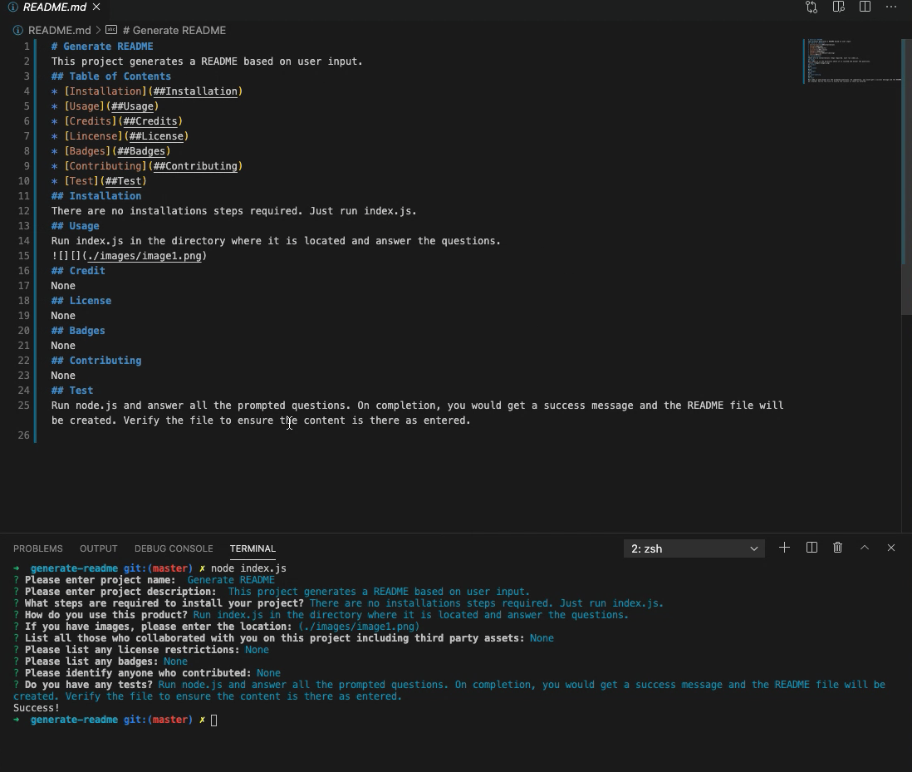

# Generate README
  
This project generates a README file based on responses given by the user.

## Table of Contents
* [Installation](#installation)
* [Usage](#usage)
* [Credits](#credits)
* [Lincense](#license)
* [Contributing](#contributing)
* [Test](#test)
* [Questions](#questions)
## Installation
No installation required.
## Usage
Run "node index.js" in the directory where the "index.js" is. You will see a series of prompts, answer each one and a README will be created. 

## Credits
NA
## License
MIT
## Contributing
NA
## Test
Run "node index.js" and answer each prompt/question. Upon completion, the console will messahe "Success!" and the README will be created. Check the README to verify that it was created as expected.
## Questions
No questions at this time.
